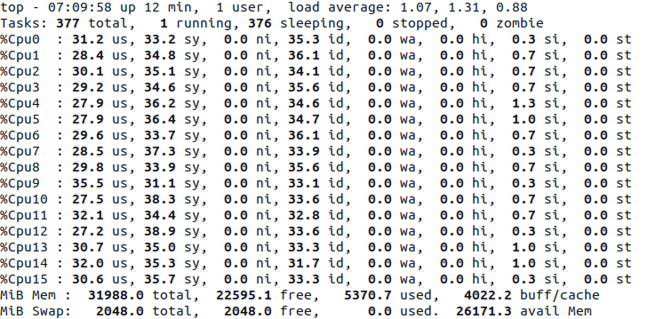

# Noddy Integer to Roman Numeral Converter in Java as a rest service

In this implementation algorithm uses a json config file

There seem to be several ways of implementing large roman numbers and config files gives us the possibility of switching between them.

I have opted for the using the vinculum to represent value 1000 times its original. So X (10) with one vinculum is 10,000.
Unfortunately the triple vinculum display for numbers like 9,900,000,000 is less than impressive unless you make the displayed terminal font large.

I suggest a font like Consolas that has the suitable unicode glyphs.

This implementation represents roman numbers a bit more like arabic numbers with different strings for each digit that get concatinated together. Just that zero is an empty string.

### Usual Gradle instructions
To build and test
```bash
./gradlew build
```

To start the service on http://localhost:8080/roman/1
(replace 1 with whatever number that you are converting)
```bash
./gradlew bootRun
```

### Analysis

Have a bash at overloading it.
```bash
     seq 1 100000 | xargs -P0 -I{} curl -s http://localhost:8080/roman/{}
```

Timing such a sequence of 100000 being piped to /dev/null on this 16 Core AMD Ryzen 7 gives 
```
real	0m39.357s
user	3m0.795s
sys	3m6.679s
```
Or an apparent 394 µ seconds per REST call, though in fact each call is longer there are at least 16 threads.
So it is more like each REST call took about 6 milliseconds just they overlapped with 15 others.

Looking at the "top" command output, we can see that Tomcat and Spring do quite a good job of splitting the load across the CPUs.

